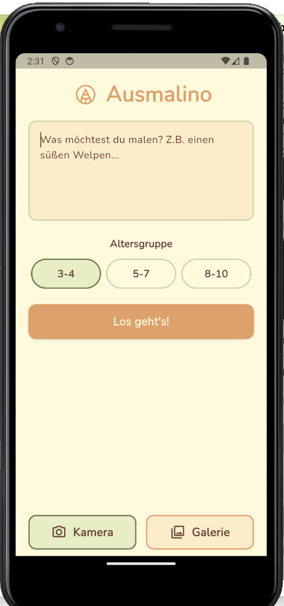
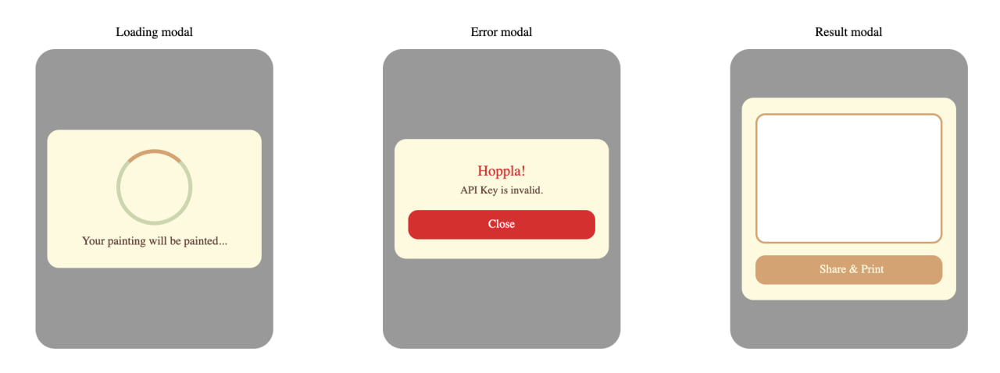

# Ausmalino

A cute little Flutter project for you to generate coloring pictures.

Ausmalino turns a short description or a photo into a printable, black-and-white
coloring page for kids, powered by OpenAI's image generation and Stability
AI's Structure endpoint. Simply pick an age group, describe what to draw (or snap a
photo), and get back clean line art ready to print and color in :)

## Description

NOTE: The original version of this app is built as a Capacitor/HTML/CSS/JS app and 
is already live on the App Store. This repository is a full 
Flutter rewrite: same design, same two generation paths, native camera/gallery
access, and a share sheet for printing.

The owner of this app is: Gesa Marie Anna Senst. 
Link to the app: https://apps.apple.com/de/app/ausmalino/id6756326105?l=en-GB


## Screenshots

<p align="center">
  
</p>
<br>

<p align="center">
  
</p>

## Features

- **Text-to-image**: describe what to draw, get a coloring page back (OpenAI DALL-E 3)
- **Photo-to-line-art**: take or pick a photo, get it converted into line art (Stability AI Structure)
- **Age-aware prompts**: three age groups (3-4, 5-7, 8-10) each tune line thickness and detail level
- **Share & print**: send the result straight to the native share sheet
- **Clean architecture**: models, services, and UI are fully separated 

## Getting started

```bash
git clone https://github.com/<your-username>/ausmalino.git
cd ausmalino
flutter pub get
```

### ⚠️ API keys — required before running

This app calls OpenAI and Stability AI directly from the client, so **you need
your own API keys** to generate anything. The repository does **not** and
**will never** contain real keys — only a template.

**Setup:**

1. Copy the template file:
   ```bash
   cp lib/services/api_keys.example.dart lib/services/api_keys.dart
   ```
2. Open `lib/services/api_keys.dart` and paste in your own keys:
   ```dart
   class ApiKeys {
     ApiKeys._();

     static const String openAi = 'sk-your-real-openai-key';
     static const String stability = 'sk-your-real-stability-key';
   }
   ```
3. Run the app:
   ```bash
   flutter run
   ```

`lib/services/api_keys.dart` is listed in `.gitignore` and is never committed.
If you fork or clone this repo, **you must create this file yourself** —
without it, the app builds and runs fine, but every generation request fails
with "API Key ist ungültig."

Where to get keys:
- OpenAI: https://platform.openai.com/api-keys (requires prepaid billing. No free tier for image generation)
- Stability AI: https://platform.stability.ai/account/keys (new accounts get 25 free trial credits)